# Kiki Flashcards App
Kiki is a flashcard app based on the famous [Anki Desktop App](https://apps.ankiweb.net/). Kiki allows user to create, manage, and edit flashcards, and is fully compatible with Anki shared decks. 

## Features
### - Compatible with Anki cards natively, with images and audio support!

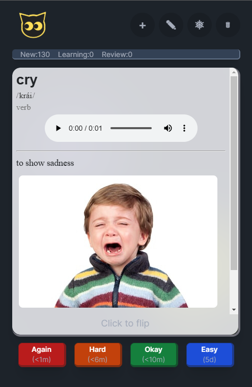
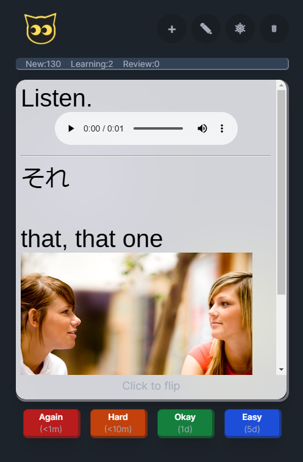
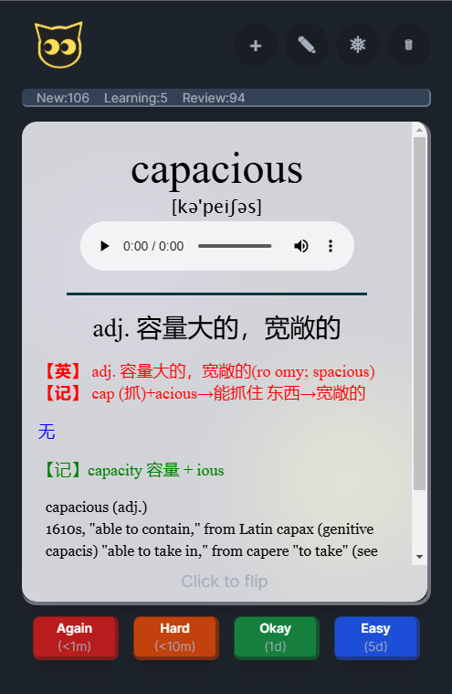
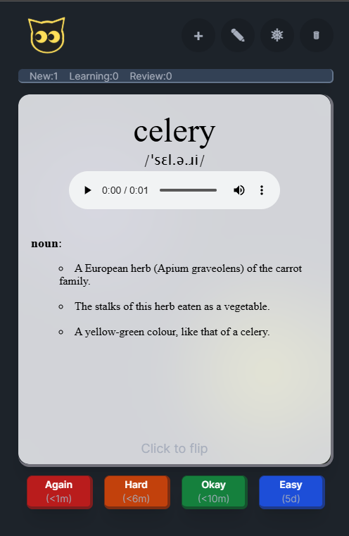

### - Easily import anki decks.

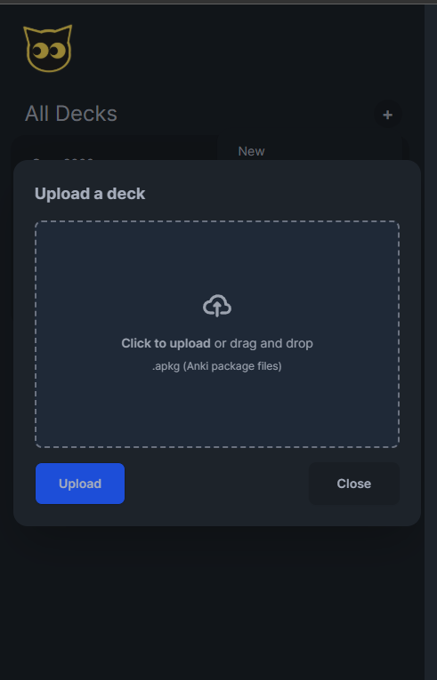
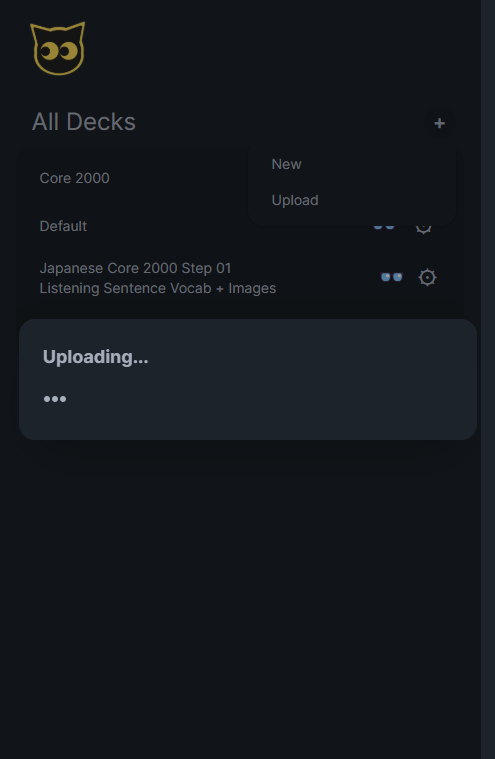
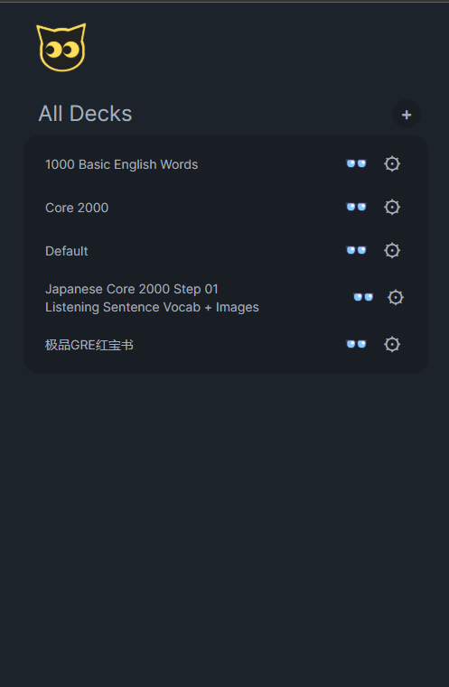

### - Create, edit, and delete flashcards.

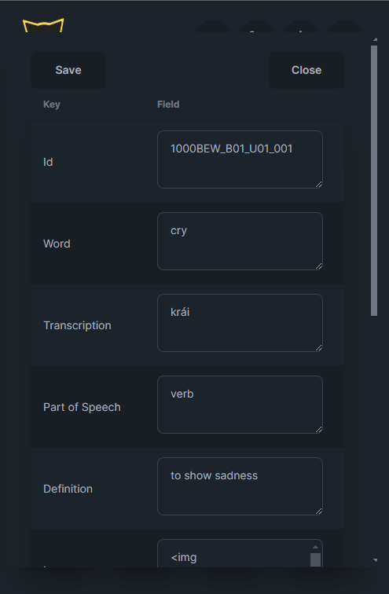
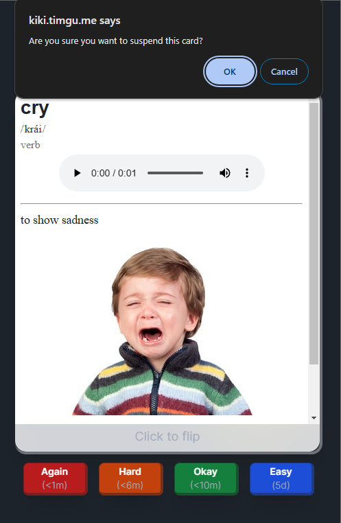
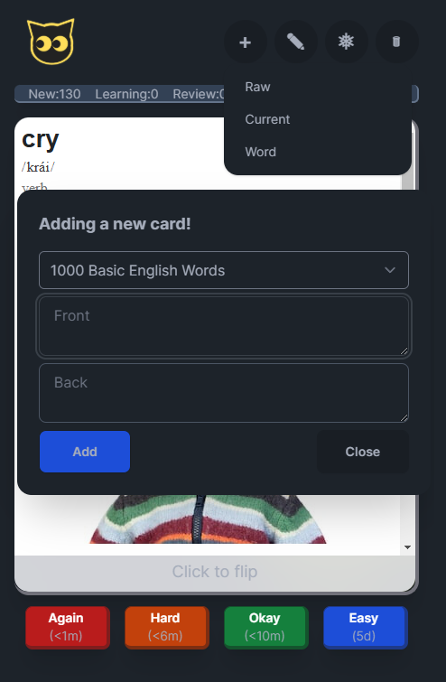
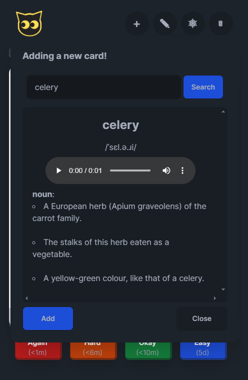

### - Browse through your deck and manage your study plan

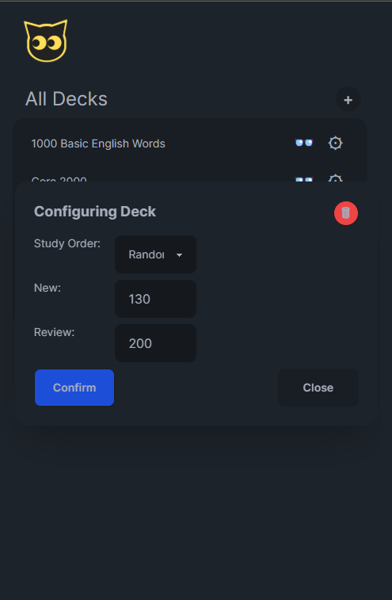
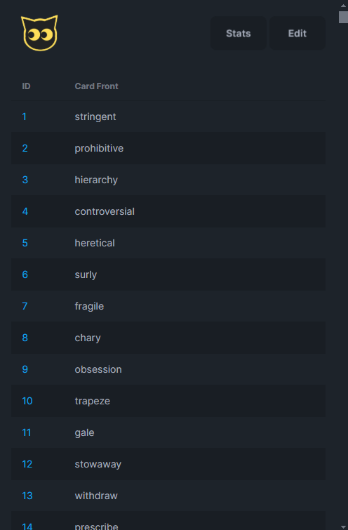
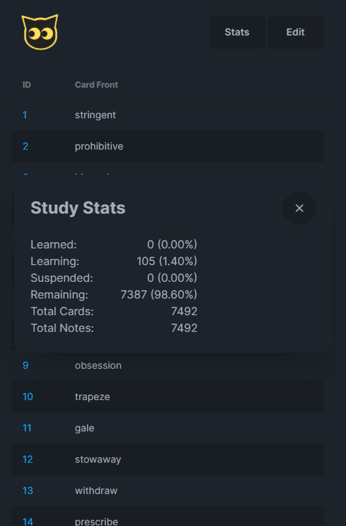

